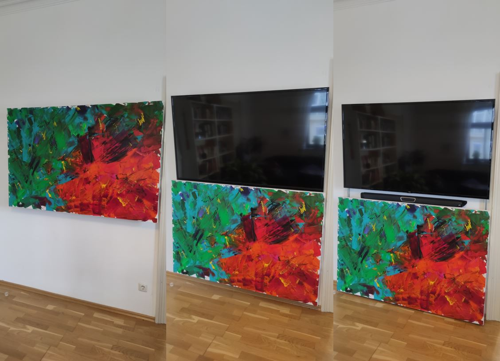
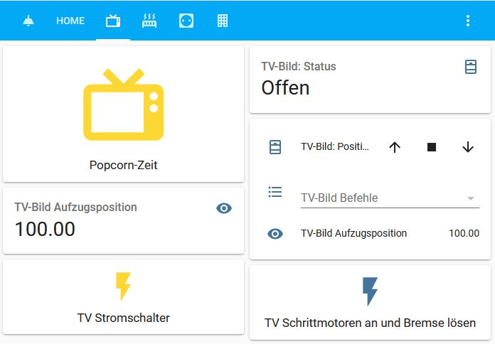
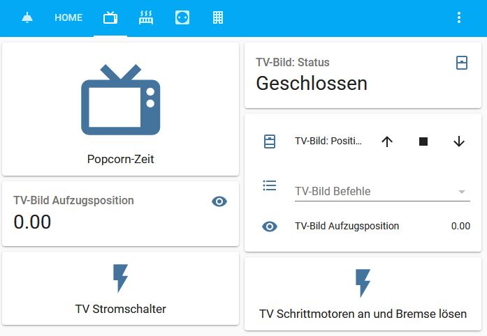
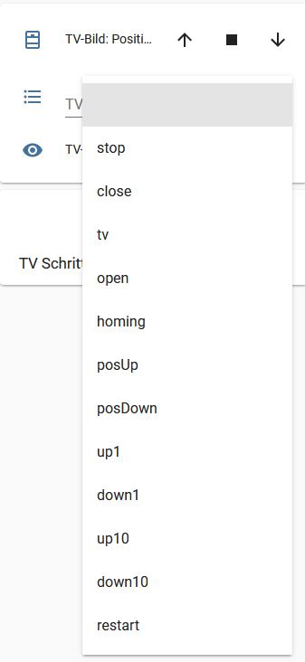
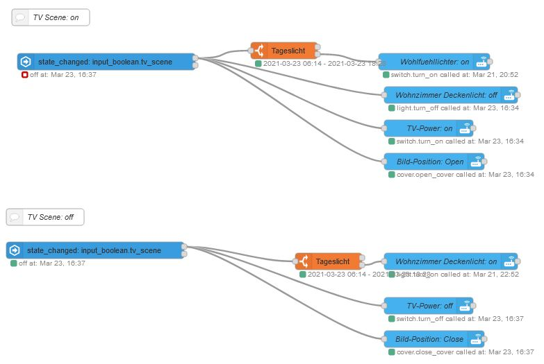
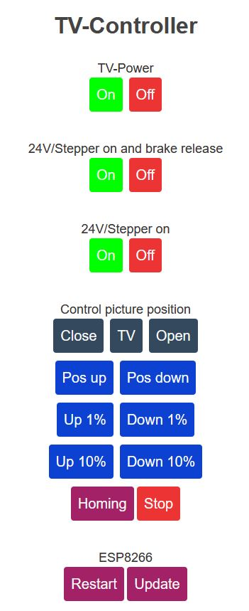
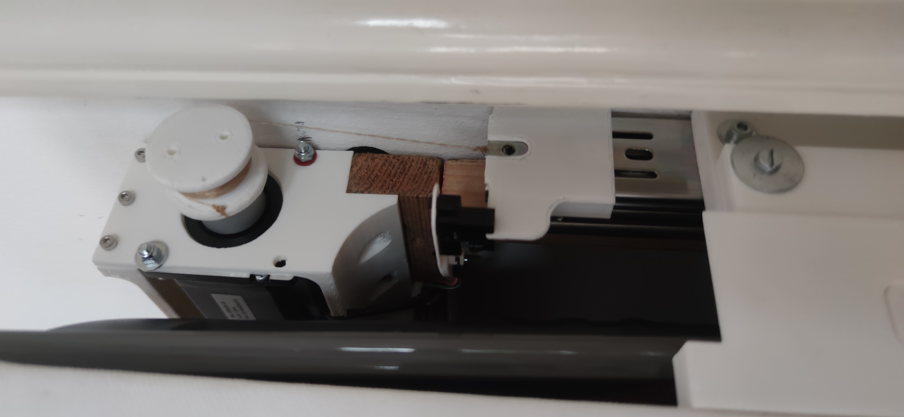
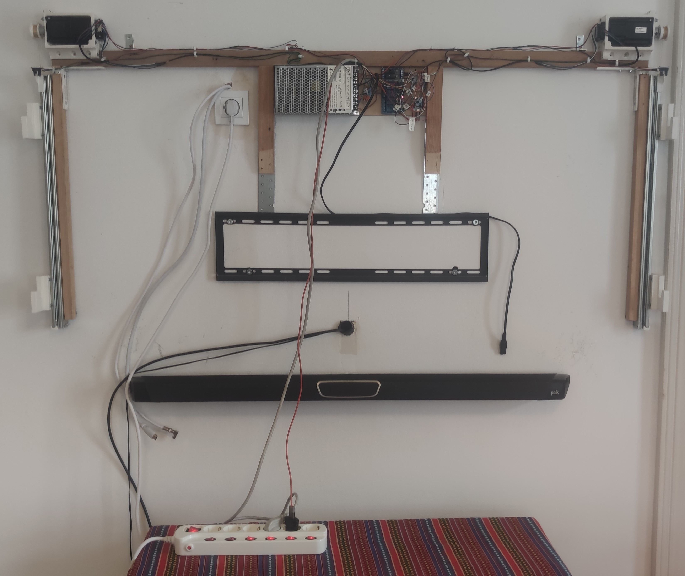

# tv-cover-control
Control a stepper motor driven cover to hide your TV and switch power with an ESP8266 (Wemos D1 mini) feeded via MQTT (e.g. Home Assistant).

Position (close, tv, open) comparisson:  

Sideview:  

Home Assistant with cover open:  

Home Assistant with cover closed:  

Home Assistant command via dropdown:  

NODE-RED overview - combine lights (depending on daylight) and power switch of tv with the tv-cover in a single switch ("Popcorn-Zeit"):  

Control backup via HTML page from webserver which is hosted directly on the ESP8266 (if home assistant fails):  

Detail view of winch with stepper and sensor:  

Front view without picture:  
